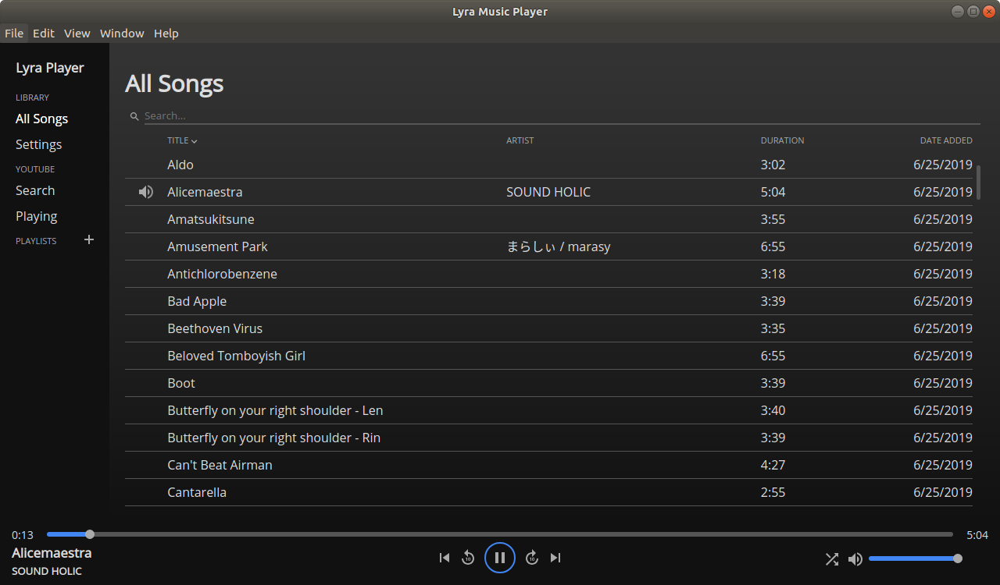
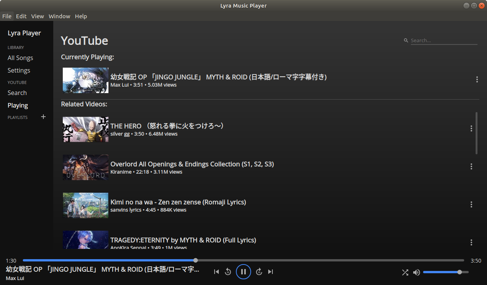

# Lyra Music Player

Lyra is a cross-platform music player app that can play songs on your computer and on YouTube.

Check out the [lightweight version](https://github.com/LenKagamine/lyra-neutrino) built with [Neutrino](https://github.com/LenKagamine/neutrino)!

## Features

- Songs
  - Add songs on your computer and play them
  - Remove songs
- Playback
  - Volume control
  - Shuffle
  - Skip forward / back 10 seconds
  - Skip to previous / next song
  - Media button shortcuts (Play, Pause, Skip)
- Song metadata
  - Parses title and artist metadata
  - Edit metadata within the player
- Playlists
  - Create and delete playlists
  - Add and remove songs to playlists
  - Play songs in a playlist
- YouTube
  - Search for YouTube videos
  - YouTube video playback
  - Autoplay
  - Shows related videos
  - Add video to library
  - Download YouTube video as audio

## Screenshots

<div align="center">
  
  
</div>

## Development

To run locally, clone the repo and run the following:

```
npm install
npm run dev
```

To build the executable, you have two options:

```sh
# Create unpacked release
npm run dist

# Create packaged executable
npm run pack
```

TODO:

- Keyboard shortcuts
  - Space to play/pause
  - Left/right arrow keys to skip 10 seconds
- Editing metadata input fields should wrap
- Setup browser build target
  - Extract all platform specific code into separate file
    - Browser, desktop
  - Browser
    - Settings only has "Clear data"
    - Storage: localStorage?
    - How to get the webpack config? electron-webpack
- Show queue
- Queue management
  - Cap previous queue list to 50? songs
  - Song getting pushed off of prev queue will be removed from cache if it's in it
  - If song in cache is added, it should be removed from cache

Refactor:

- Unify lyra and lyra-native
  - Use css-in-js similar to react native's stylesheets (?)
    - move variables.scss to constants.js
  - standardize file names
    - rangeinput -> slider
    - songItem -> song-item
  - standardize common utils
    - useToggle hook
- Screen display
  - currently, it's hacked together with playlists
  - playlists / all songs should be seperately handled from other screens (e.g. settings, youtube)
  - loading all songs is laggy due to reloading all songs again
    - bring `getSongList` into component, and only update if props change
  - new screen management:
    - currScreen: 'MAIN' | 'PLAYLIST' | 'SETTINGS' | 'YOUTUBE'
    - currSubScreen: PlaylistID | 'SEARCH' | 'PLAYING'

Minor fixes:

- Scroll bar
  - Sidebar scroll bar should only scroll playlists?
- Deleting playlist
  - Show confirmation modal?
- Inconsistent action to open context menu
  - Youtube playing: click options icon
  - Library: right click

Bugs:

- Sorting by name should ignore punctuation (like brackets)
- If the song skips before related songs are loaded, it won't autoplay the next song
- Linux:
  - If something else takes control of the media buttons and releases them, the media buttons won't work anymore

Song types:

- Shared data format:
  - id
  - title
  - artist
  - duration
  - date
  - playlists
  - source
  - location
- Locally sourced song
  - Data format
    - id: hash of filepath
    - source: "LOCAL"
    - location: filepath
- Youtube video
  - Data format
    - id: video id
    - artist: channel name
    - views
    - thumbnail
    - source: "YT"
    - location: video id
    - local: whether it is downloaded or not ?
- Downloaded Youtube song

  - Data format
    - id: video id
    - source: "YT-LOCAL"
    - location: filepath

- new data
  - where the current song is playing from
  - all songs? playlist? youtube?
  - Add new sidebar item: "Now Playing"
  - opens the respective screen for the song

Long term features:

- Music metadata
  - Edit metadata on song add
- Drag and drop
  - Add songs to all songs
  - Add songs to playlists
  - Add songs into playlists
- Youtube
  - Pagination
  - Open in browser
- Online
  - Make account
  - Show songs saved online
  - Stream songs
  - Download songs
    - When listening to a Youtube song, download it in the background as a cache
    - Future playbacks and actual downloads will fetch from server's cache instead
  - Upload songs
- Web App
  - Change storage to localStorage?

Ideas:

- Song row interaction
  - Single click does nothing
  - Double click to play
  - Play button on left
    - Single click to play
  - Right click to open menu
    - Play, Edit
      - Edit is same
- Download from Youtube
  - Server download, since it requires converting to mp3
- Hover over seek bar
  - Show time over cursor

Note:

- Media button shortcuts don't work normally in Linux. To get around it, the player uses `dbus` to directly access shortcuts. `dbus` requires several other packages to install:
  - `npm i -g node-gyp`
  - `sudo apt-get install libdbus-1-dev libglib2.0-dev`
  - Upon installing `dbus`, node will build the package for use. However, there may be differences in Node and Electron `NODE_MODULE_VERSION`s.
    - See more here: https://electronjs.org/docs/tutorial/using-native-node-modules
- On macOS Mojave (and higher), access to media keys requires accessibility permissions. In this case, Lyra will display a dialog requesting permissions.
- On Linux, running the AppImage for the first time will install the desktop file in `~/.local/share/applications/` for desktop integration. However, if the path to the AppImage has a space in it, the desktop file will have an incorrect value for `TryExec`, making it unable to run.
  - `TryExec` doesn't support quotes, so spaces in the path must be escaped. However, they are escaped with `\\s` rather than `\s`.
    - See https://github.com/AppImage/AppImageKit/issues/948 and https://github.com/electron-userland/electron-builder/issues/3547
  - My fix is to set the AppImage executable name to something without spaces. As long as the directories in the path don't have spaces, the integration should work normally.
